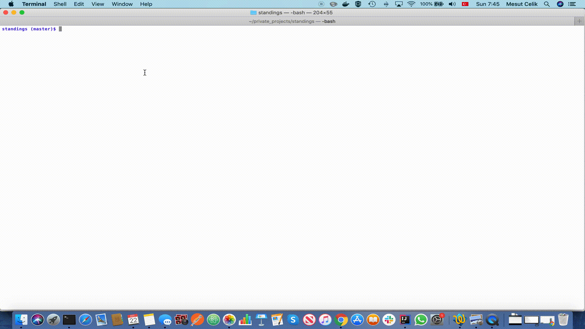

# standings
A simple script to generate standing table for sports through Google Search. It only supports macOS for now.



# Install

## Chromedriver
[Download](https://sites.google.com/a/chromium.org/chromedriver/downloads) Chromedriver suitable for your browser version and place it to the same folder next to standings.py

## Selenium
Install [Selenium](https://pypi.org/project/selenium/)

# Run

```
python standings.py
```

# TODO
- More Sports
- More Browsers
- More OS Support
